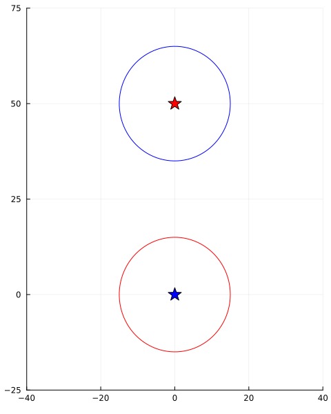
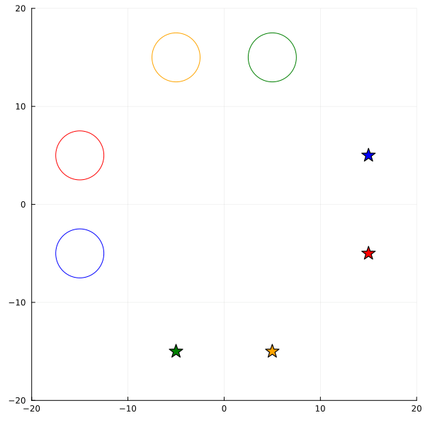
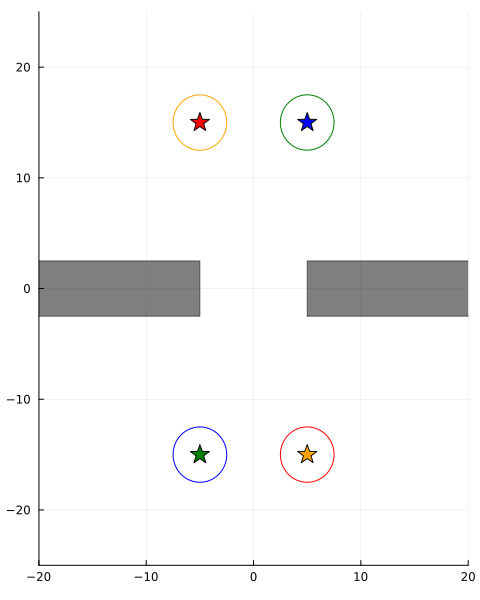

# Uncertainty-Aware Multi-Agent Trajectory Planning with NUV Priors
*By Bart van Erp, Dmitry Bagaev, Albert Podusenko Ismail Senoz and Bert de Vries*

---
**Abstract**

This paper presents a probabilistic model-based approach to centralized multi-agent trajectory planning. This approach allows for incorporating uncertainty of the state and dynamics of the agents directly in the model. Probabilistic inference is then efficiently automated using message passing. The recently introduced normal-with-unknown-variance (NUV) priors are used to prevent collisions between agents and obstacles. Furthermore, a new expectation-maximization inference scheme is presented for box and halfspace priors, which takes state uncertainty into account when avoiding collisions.


<div style="display: flex; align-items: center;">



</div>

---
This repository contains all experiments of the paper.

## Installation instructions
1. Install [Julia](https://julialang.org/)

2. activate environment (using `]` and backspace you can switch between the regular prompt and package manager)
```julia
>> ] activate .
```

3. instantiate environment (only required once)
```julia
>> ] instantiate
```

4. start Pluto
```julia
>> using Pluto; Pluto.run()
```
